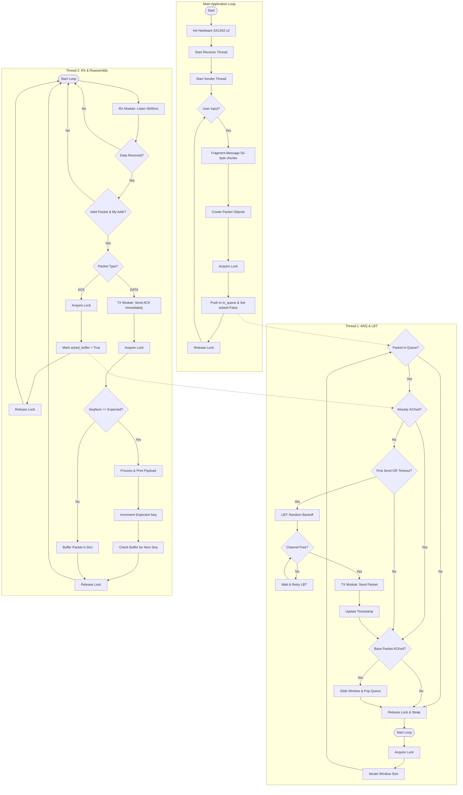
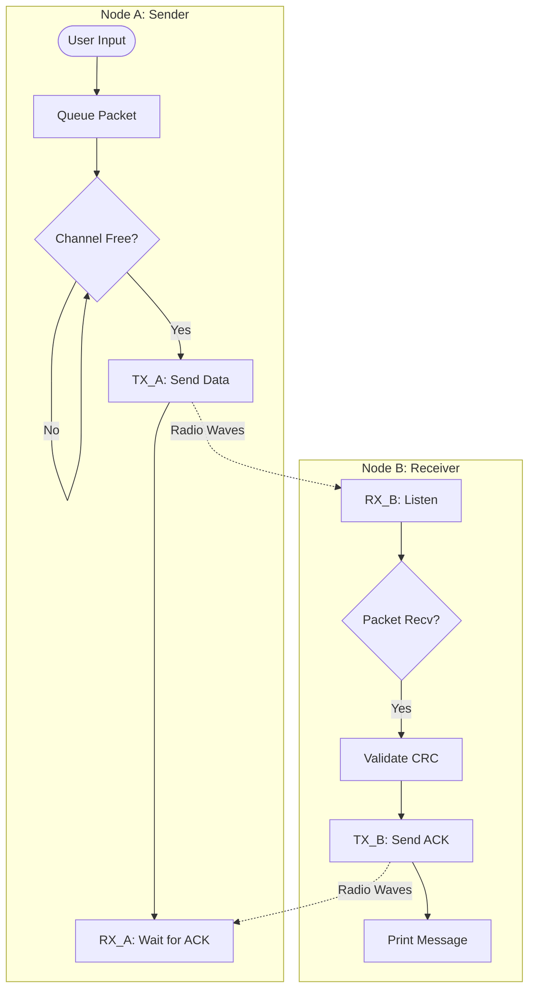
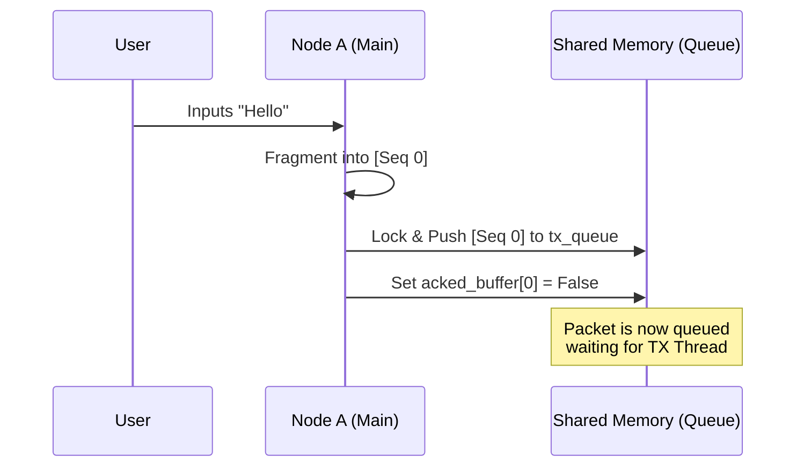
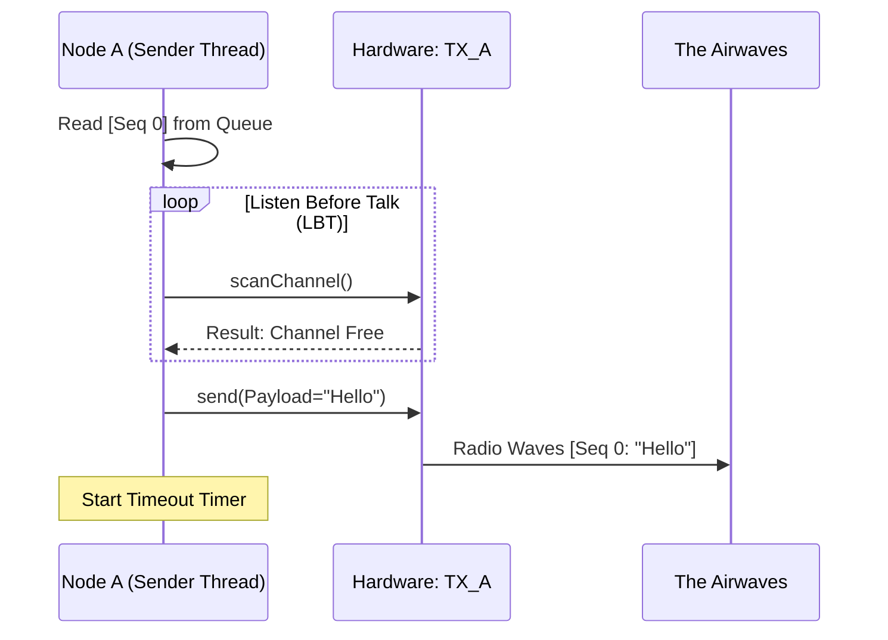
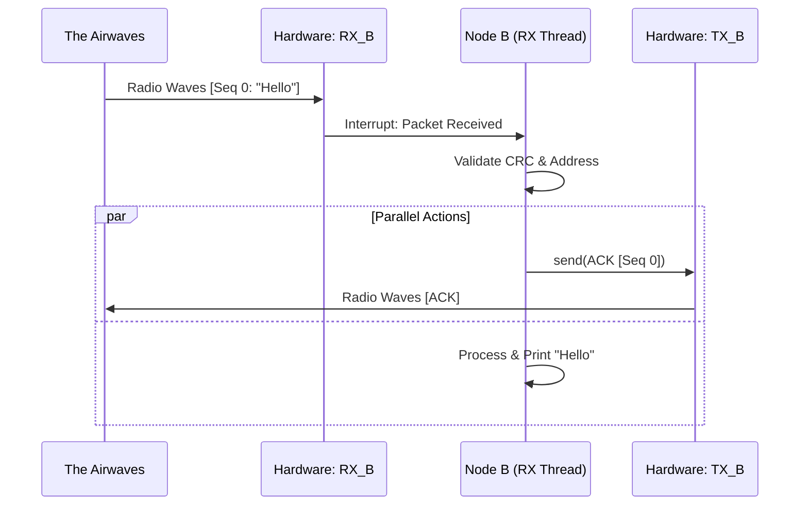
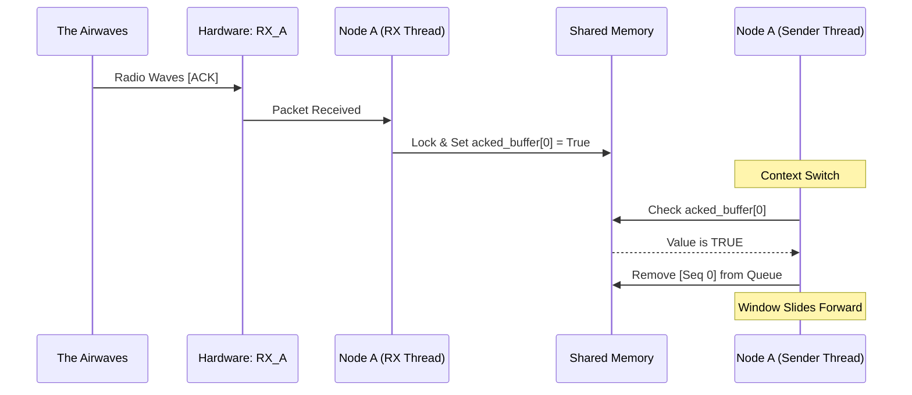

# LoRa Mesh System v1.2 - Protocol Flow Documentation

## 1. System Overview
This system implements a reliable "Listen Before Talk" (LBT) protocol using a Dual-Radio architecture (ESP32 + 2x SX1262). 
* **Node A (Sender):** Uses `TX_A` for transmission and `RX_A` for confirmation.
* **Node B (Receiver):** Uses `RX_B` for continuous listening and `TX_B` for replying.

### High-Level Logic Flow

---

## 2. Detailed Process Breakdown

### Phase 1: Input & Fragmentation (Node A Internal)
**Description:**
The process begins when the user interacts with Node A.
1.  **User Input:** The user types the message "Hello" into the console of Node A.
2.  **Main Thread Processing:** The main application thread captures this input.
3.  **Fragmentation:** The system checks the message length. Since "Hello" is short, it creates a single packet (Sequence 0).
4.  **Queueing:** The Main Thread acquires a thread lock to ensure safety, pushes the packet into the `tx_queue`, and initializes its status in the `acked_buffer` as `False` (Not Acknowledged).
5.  **Status:** The packet is now waiting in memory, ready for the Sender Thread to pick it up.

---

### Phase 2: Transmission & LBT (Node A -> Air)
**Description:**
The dedicated Sender Thread on Node A handles the physical transmission.
1.  **Wake Up:** The Sender Thread wakes up and iterates through the `tx_queue`. It sees `[Seq 0]` is waiting and has not been ACKed.
2.  **LBT (Listen Before Talk):**
    * The thread commands module **TX_A** to scan the current frequency.
    * It measures the RSSI (Signal Strength) of the noise floor.
    * If the channel is busy, it waits/sleeps (Backoff).
    * If the channel is free, it proceeds.
3.  **Transmission:** The Sender Thread commands **TX_A** to transmit the packet.
4.  **Timestamping:** Immediately after sending, Node A records the current time. This is used to trigger a retransmission (Timeout) later if no confirmation arrives.

---

### Phase 3: Reception & Immediate Reply (Node B)
**Description:**
Node B receives the message and ensures reliability by replying.
1.  **Continuous Listening:** Module **RX_B** on Node B has been in receiving mode continuously.
2.  **Packet Capture:** **RX_B** detects the preamble and captures the "Hello" packet.
3.  **Validation:** The Receiver Thread checks the CRC (Cyclic Redundancy Check) and confirms the destination address matches Node B.
4.  **The Hand-off:** The Receiver Thread immediately identifies this as a `DATA` packet. It constructs an `ACK` packet.
5.  **ACK Transmission:** The Receiver Thread commands **TX_B** (Node B's transmitter) to send the Acknowledgement back to Node A. This is the "Dual-Radio" advantage—receiving on one, replying on the other.
6.  **Application Output:** The message "Hello" is printed to Node B's screen.

---

### Phase 4: Closing the Loop (Node A Receives ACK)
**Description:**
Node A confirms delivery and cleans up its memory.
1.  **Listening:** While **TX_A** was sending, module **RX_A** was listening in the background.
2.  **ACK Capture:** **RX_A** receives the ACK packet sent by Node B.
3.  **State Update:**
    * The Receiver Thread on Node A processes the ACK.
    * It acquires the thread lock and updates the shared memory: `acked_buffer[0] = True`.
4.  **Window Slide:**
    * The Sender Thread (from Phase 2) checks the status again.
    * It sees that `[Seq 0]` is now `True`.
    * It removes `[Seq 0]` from the queue and "slides the window" forward to accept new messages (e.g., Seq 1).

