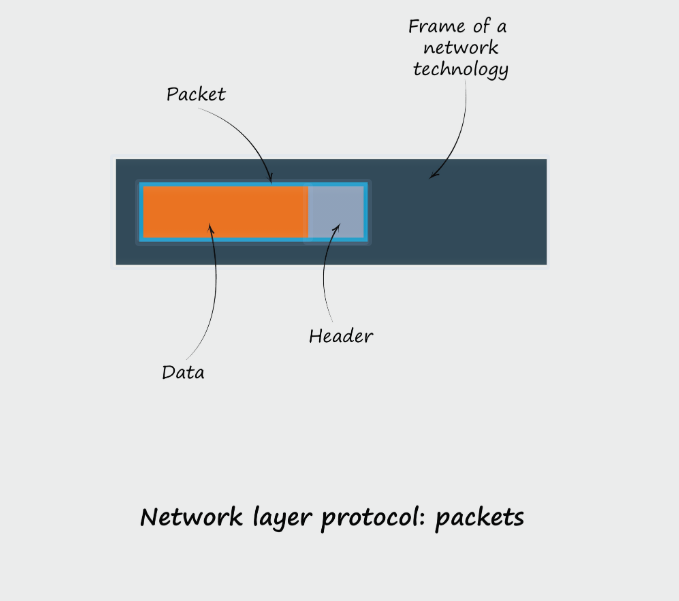

Here is the detailed technical documentation for **LoRa Mesh System v1.1**. This document provides an in-depth reference for the system architecture, hardware interface, protocol specifications, and code logic.

# LoRa Mesh System v1.1 Technical Documentation

## 1\. System Architecture

**Version:** 1.1 (Point-to-Point LBT Implementation)
**Hardware Platform:** ESP32-S3 (or compatible) with Dual SX1262 LoRa Modules.

### 1.1 Dual-Radio Design Strategy

To achieve full-duplex emulation and robust collision avoidance, the system utilizes two separate LoRa modules:

  * **Module 1 (TX / Scanner):** This radio is dedicated exclusively to outgoing traffic. It remains in `STANDBY` mode until a message needs to be sent. Crucially, it performs the **Channel Activity Detection (CAD)** scans required by the Listen Before Talk (LBT) algorithm.
  * **Module 2 (RX / Listener):** This radio is dedicated exclusively to incoming traffic. It remains in continuous `RX` (Receive) mode. This ensures that the node never misses an incoming packet while processing user input or waiting for a clear channel to transmit.

-----

## 2\. Hardware Interface

The system requires two SX1262 modules connected via separate SPI buses.

### 2.1 Pin Configuration Map (ESP32-S3)

| Component | Function | Module 1 (TX) | Module 2 (RX) | Description |
| :--- | :--- | :--- | :--- | :--- |
| **SPI Bus** | Data Transfer | **SPI 1** | **SPI 2** | Separate buses prevent resource locking conflicts. |
| **SCK** | Serial Clock | GPIO 2 | GPIO 11 | Clock signal for SPI communication. |
| **MOSI** | Master Out | GPIO 3 | GPIO 10 | Data sent from ESP32 to LoRa. |
| **MISO** | Master In | GPIO 4 | GPIO 9 | Data sent from LoRa to ESP32. |
| **CS** | Chip Select | GPIO 1 | GPIO 12 | Active Low signal to select the specific module. |
| **RST** | Reset | GPIO 5 | GPIO 8 | Hard reset pin for the module. |
| **DIO1** | IRQ | GPIO 18 | GPIO 13 | Interrupt pin (triggers on RX Done, TX Done, etc.). |
| **BUSY** | Busy Status | GPIO 6 | GPIO 7 | Indicates module is processing a command. |

-----

## 3\. Protocol Specification: "Mini Algorithm"

To minimize airtime and latency, v1.1 uses a compressed **4-Byte Header**.

### 3.1 Packet Structure Diagram


```
| Byte 0       | Byte 1       | Byte 2          | Byte 3       | Byte 4...N      |
|--------------|--------------|-----------------|--------------|-----------------|
| TO_ADDR      | FROM_ADDR    | INFO_BYTE       | LEN          | PAYLOAD         |
| (Target ID)  | (Sender ID)  | (ID + Type)     | (Data Size)  | (Variable Data) |
```

### 3.2 Field Definitions

1.  **`TO_ADDR` (1 Byte):**

      * Range: `0x00` - `0xFE` (Unicast Addresses)
      * Reserved: `0xFF` (Broadcast - all nodes receive)
      * *Usage:* Checked by the receiver. If it matches `MY_ADDR` or `0xFF`, the packet is processed.

2.  **`FROM_ADDR` (1 Byte):**

      * Range: `0x00` - `0xFE`
      * *Usage:* Identifies the sender for replies (ACKs) and display.

3.  **`INFO_BYTE` (1 Byte - Bit Packed):**

      * **High Nibble (Bits 7-4): `MSG_ID`**
          * A 4-bit rolling counter (`0` to `15`).
          * Used to detect duplicate packets and match ACKs.
      * **Low Nibble (Bits 3-0): `PKT_TYPE`**
          * `0x01` (**DATA**): Contains user message.
          * `0x02` (**ACK**): Acknowledgment (Payload length 0).
          * `0x00`, `0x03-0x0F`: Reserved.

4.  **`LEN` (1 Byte):**

      * Indicates the size of the following Payload.
      * Maximum: 50 Bytes (Hard limit in `MiniPacket` class).

-----

## 4\. Module Reference: `mini_protocol.py`

### Class: `MiniPacket`

#### `__init__(self, to_addr, from_addr, msg_id, pkt_type, payload=b'')`

Initializes a packet object.

  * **Truncation Logic:** Automatically truncates `payload` to 50 bytes to enforce airtime limits.
  * **Bit Masking:** Applies `& 0x0F` to `msg_id` and `pkt_type` to ensure they don't overflow into each other's nibbles.

#### `to_bytes(self) -> bytes`

Serializes the object for transmission.

  * **Logic:**
    ```python
    info_byte = (self.msg_id << 4) | self.pkt_type
    ```
    *Shifts the Message ID 4 bits to the left and performs a bitwise OR with the Packet Type to combine them.*

#### `from_bytes(data) -> MiniPacket`

Deserializes raw bytes from the radio.

  * **Validation:** Returns `None` if `len(data) < 4` or if the received buffer is shorter than the `LEN` header indicates.
  * **Unpacking:**
    ```python
    msg_id = (info_byte >> 4) & 0x0F
    pkt_type = info_byte & 0x0F
    ```

-----

## 5\. Module Reference: `main.py`

### 5.1 Configuration Constants

  * **`MY_ADDR` / `TARGET_ADDR`**: Static addressing for v1.1. Must be swapped on the second device.
  * **`MAX_LBT_RETRIES` (5)**: Defines how persistent the node is when the channel is busy.
  * **`INITIAL_BACKOFF_MAX` (32ms)**: The window for the pre-scan delay.
  * **`RETRY_BACKOFF_MIN/MAX` (50-150ms)**: The window for exponential backoff if a collision is detected.

### 5.2 LoRa Radio Configuration

Both radios are initialized with identical RF parameters to ensure compatibility:

  * **Frequency:** 866 MHz
  * **Spreading Factor (SF):** 9. *Chosen as a balance between range and "Time on Air". Lower SF allows for faster CAD checks.*
  * **Bandwidth:** 125 kHz.
  * **Coding Rate:** 4/7.
  * **Sync Word:** `0x1424` (Private). *Isolates traffic from other public LoRa networks.*

### 5.3 Algorithm: `lbt_send` (Listen Before Talk)

This function implements the collision avoidance logic defined in the design document.

**Detailed Logic Flow:**

1.  **Serialization:** Converts the `MiniPacket` object to a byte array.
2.  **Phase 1: Desynchronization**
      * The system sleeps for `random(0, 32) ms`.
      * *Purpose:* If two nodes react to an event simultaneously, this random pause ensures they don't scan at the exact same microsecond.
3.  **Phase 2: Channel Scan Loop**
      * **Action:** Calls `sx_tx.scanChannel()`.
      * **Underlying Driver:** The driver sets the radio to CAD mode. It listens for the specific LoRa Preamble.
      * **Result - Free (`-15`):**
          * The radio immediately switches to TX mode.
          * Packet is sent.
          * Function returns `True`.
      * **Result - Detected (`-702` or others):**
          * The channel is considered "Busy".
          * **Backoff:** The system sleeps for `random(50, 150) ms`.
          * **Retry:** Increments attempt counter and loops back to Scan.
4.  **Phase 3: Timeout**
      * If `attempt > MAX_LBT_RETRIES`, the packet is dropped to prevent the system from hanging indefinitely.

### 5.4 Algorithm: `rx_loop` (Continuous Reception)

This function runs on a dedicated thread to ensure non-blocking operation.

**Detailed Logic Flow:**

1.  **Setup:** Runs in an infinite `while True` loop.
2.  **Listening:** Calls `sx_rx.recv()` with `timeout_en=True`.
      * *Note:* A timeout (e.g., 1000ms) is used instead of blocking indefinitely. This allows the thread to check for exit conditions or handle errors gracefully without freezing the SPI bus forever.
3.  **Parsing:**
      * On data receipt, it attempts to create a `MiniPacket`.
      * **Address Check:** It verifies `pkt.to_addr == MY_ADDR` or `0xFF`. Packets for other nodes are ignored (promiscuous mode is off).
4.  **Output:** Valid messages are decoded (UTF-8) and printed to the serial console.

-----

## 6\. Usage & Integration

### 6.1 Setup Instructions

1.  **Flash Node A:**
      * Set `MY_ADDR = 0x0A`
      * Set `TARGET_ADDR = 0x0B`
      * Upload `mini_protocol.py` and `main.py`.
2.  **Flash Node B:**
      * Set `MY_ADDR = 0x0B`
      * Set `TARGET_ADDR = 0x0A`
      * Upload `mini_protocol.py` and `main.py`.

### 6.2 Runtime Operation

1.  Open Serial Monitors for both devices.
2.  **RX Thread:** You will see `[RX] Listening on Module 2...`.
3.  **Sending:**
      * Type a message and press Enter.
      * Log: `[TX] Attempting to send...` -\> `[TX] Sent`.
4.  **Collision Simulation:**
      * If you type on both terminals simultaneously, you may see `[TX] Busy... Backing off...`. This confirms the LBT algorithm is active and working.
